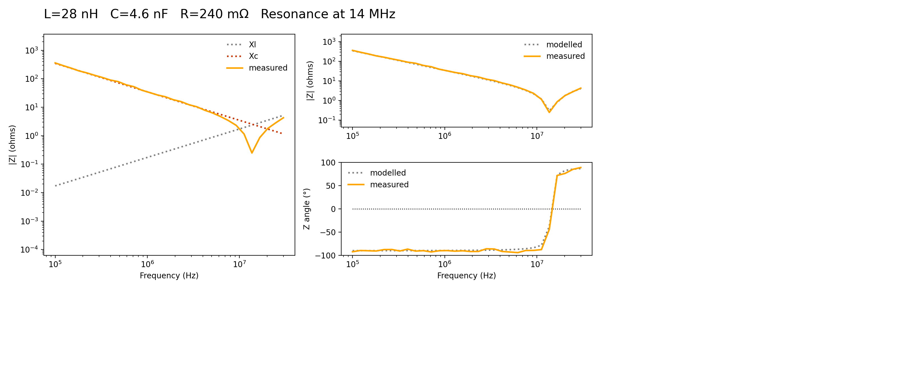

# Simple impedance analyser

There are many good quality speciality impedance analysers on the market.   This project is for those who want a quick measurement with little fuss using the equipment already on the bench.

A programmable function generator sweeps the required spectrum and applies a signal, through a fixed sense resistor, to the device under test.  Oscilliscope probes are connected to both sides of the sense resistor i.e. function generator and device under test.

Complex impedance is calculated and plotted as magnitude and phase.  Sliders can be used to adjust a RLC model for the best (subjective) fit to the device under test.

Phase measurements with this type of equipement are no where near as good as a specialty impedance analyser.  In an attempt to get decent measurements the oscilliscope sweep frequency and range are continuously adjusted.  About six complete cycles will be displayed and roughly 80% of the verticle range used.  This means a few measurements are taken at each frequency and this increases the test duration.  

Care should be taken to minimise lead impedance and noise.  Radio amateur W2AEW has a great range of tutorials and this one is particularly relevant:  https://www.youtube.com/watch?v=zodpCuxwn_o

This code is specific to the Rigol DG1032Z function generator and DS1054Z.   VXI-11 commands for these instruments are similar to a wide range of devices and extension to other instruments should be possible.  Maybe.  These specific instruments use TCP-IP.  The VXI-11 library supports USB should this be your preference.

Capacitors are best characterised as a series RLC model and inductors as parallel.

The cell collapse feature within JupyterLab is useful to reduce clutter.  The first cell, which handles imports and definitions, need never be expanded.

The example is a 4n7 polyester capacitor.  The parasitic inductance and self resonance can be clearly seen.  
